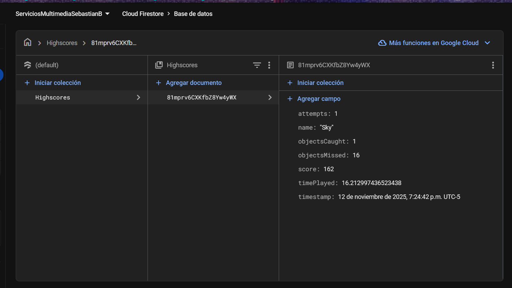

# 🎮 Falling Anvils

**Falling Anvils** es un pequeño juego desarrollado en Unity donde el jugador debe esquivar objetos que caen del cielo.  
El objetivo es sobrevivir el mayor tiempo posible y conseguir la puntuación más alta.  
Al finalizar la partida, el puntaje se guarda automáticamente en **Firebase Firestore** y se muestra un **ranking global**.

---

## 🧩 Mecánicas del juego

- Los objetos (yunque u otros prefabs) caen desde el cielo.
- El jugador puede moverse lateralmente para esquivar los objetos.
- Si el jugador colisiona con uno de ellos, la partida termina.
- Mientras siga con vida, el puntaje aumenta con el tiempo.

---

## 🏆 Sistema de puntuación y Firebase

El juego se conecta con **Firebase Firestore** para almacenar los puntajes más altos.

Cada partida guarda:
- **Nombre del jugador**
- **Puntaje final**
- **Fecha y hora de la sesión**
- **Tiempo total jugado**
- **Intentos realizados**
- **Objetos atrapados o esquivados**

Los datos se almacenan en la colección:

```
Highscores
├── (documento 1)
│   ├── name: "Sebas"
│   ├── score: 1520
│   ├── timePlayed: 63.4
│   ├── date: "2025-11-12 18:42"
│   └── attempts: 3
├── (documento 2)
│   └── ...
```

### Ejemplo de la tabla en Firebase


---

## 🕹️ Flujo del juego

1. **Pantalla de inicio** → el jugador ingresa su nombre.  
2. **Juego en curso** → el jugador esquiva objetos y acumula puntos.  
3. **Pantalla final** → se muestran los puntajes más altos obtenidos desde Firebase.

---

## 🧠 Estructura del proyecto

```
FallingAnvils/
├── Assets/
│   ├── Prefabs/
│   ├── Scenes/
│   ├── Scripts/
│   │   ├── GameManager.cs
│   │   ├── PlayerController.cs
│   │   ├── ObjectSpawner.cs
│   │   ├── FirebaseManager.cs
│   │   └── UIManager.cs
│   ├── UI/
│   └── AssetsRepositorio/
│       ├── firebase_table.png
│       └── demo_juego.mp4
├── Packages/
├── ProjectSettings/
└── README.md
```

---

## 🧰 Tecnologías usadas

- **Unity** (versión 2022 o superior)  
- **Firebase Firestore SDK for Unity**  
- **TextMeshPro (TMP)**  
- **C#**

---

## 📹 Demostración del juego

🎥 Mira el video de demostración del funcionamiento del juego:

[Ver demo en el repositorio](Assets/AssetsRepositorio/FuncionamientoJuegoFallingAnvils.mp4)

---

## 👨‍💻 Autor

Desarrollado por **Sebas**  
💡 Proyecto para la materia *Servicios en la Nube - 3er Corte*  
📍 Universidad / Curso de Ingeniería Multimedia

---

## 📜 Licencia

Este proyecto es de uso académico.  
Puedes usarlo como referencia o base para proyectos personales, **citando al autor**.
